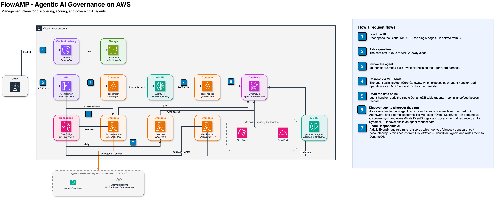

# FlowAMP: AI Agent Governance on AWS

FlowAMP is an **Agent Management Platform** - a single pane of glass to discover, monitor, score,
control, and cost-account AI agents across an AWS organization. It deploys with AWS CDK into your
own account and, by default, governs the **real** agents already running there.

**Use this as a starting point for a production deployment.** It is a working, deployable control
plane built on real AWS services - not a mock - but it ships with demo-grade defaults (see
[Production hardening](#production-hardening) before you rely on it). Fork it, harden the items
called out below, and extend the connectors/policies for your environment.

## Architecture

A single DynamoDB table is the spine. Governance is **agent-driven**: AgentCore (Strands) agents
discover, classify, and audit the account's other agents, writing normalized records to the table.
An AgentCore harness answers natural-language questions over it, scheduled Lambdas keep the
inventory / Responsible-AI scores / cost current, and a static UI (S3 + CloudFront) talks to the
backend through a Cognito-authorized API Gateway.



Agents are deployed two ways, and the distinction matters when adding your own:

- **Harness** (`AWS::BedrockAgentCore::Harness`) - model, system prompt and tools declared as
  configuration; AgentCore runs the agent loop. No container, no code bundle. Used for the
  management agent and the sample workloads.
- **Runtime** (`agentcore.Runtime`, direct-code deploy) - your own Python program, packaged as a
  zip with its arm64 dependencies vendored in at synth time by `cdk/lib/agent-bundle.ts`. Used for
  the two scanners, which have custom tools, DynamoDB writes and cross-account calls that a
  harness cannot host.

> **Bedrock Agents Classic is not used.** It [entered maintenance mode on 2026-07-30](https://docs.aws.amazon.com/bedrock/latest/userguide/agents-classic-maintenance-mode.html):
> `CreateAgent` is refused in any account without prior Bedrock Agents usage, so a stack that
> created one could not deploy into a new account. FlowAMP still **discovers and audits** Classic
> agents you already run, since the read APIs remain available and existing agents keep working.

| Component | Purpose |
|---|---|
| **DynamoDB** `AgentTable` | Single table (PK `agentId`, SK `sk`, PAY_PER_REQUEST, 90-day TTL on `EVENT#` rows). Row types by `sk`: `INFO` (entity), `EVENT#`/`AUDIT#`/`RAI#`/`COST#`/`REVIEW#`/`MODEL#`/`COMPLIANCE#`. |
| **AgentCore harness: management agent** | Managed agent loop that answers questions over the table, calling the registry tools through the Gateway below. Model via an inference profile (`us.anthropic.claude-sonnet-4-6`). **Core - always deployed.** |
| **AgentCore: `discovery-scanner`** | Governance agent that enumerates AND LLM-classifies the account's AgentCore runtimes, writing enriched catalog rows. **Owns single-account native discovery. Core - always deployed.** |
| **AgentCore: `compliance-scanner`** | Governance agent that runs a deterministic compliance-checks framework (baseline / NIST AI RMF / ISO 27001 / SOC 2 / NERC-CIP) plus LLM judgment, writing `AUDIT#` / `RAI#` rows. **Core - always deployed.** |
| **AgentCore: 3 sample agents** | Optional customer-use-case harnesses (insurance claims triage, supply-chain analyst, service request intake) that give discovery genuine agents to find. Defined in `cdk/lib/sample-agents.ts`, shared with `SampleAgentsStack`. `deploySampleAgents=true`. |
| **AgentCore Gateway** | Exposes the `agent-handler` Lambda's eight read operations to the harness as MCP tools, with SigV4 inbound auth. Replaces what was a Bedrock Agent action group. |
| **Lambda `agent-handler`** | Registry read API behind the Gateway. Speaks both the Gateway/MCP shape and the legacy action-group shape, so it stays independently testable. |
| **Lambda `discovery-handler`** | External connectors (Microsoft/Okta/MuleSoft - simulated) + real cross-account **org discovery**. Runs every 6h and on API routes. Async fire-and-forget for multi-account scans. |
| **Lambda `discovery-scan-invoker`** | Bridges the UI **Discover** button to the `discovery-scanner` runtime (which has no API of its own). Backs `POST /discovery/scan`. |
| **Lambda `compliance-scan-invoker`** | Bridges the UI **Run audit** / daily schedule to the `compliance-scanner` runtime. Fire-and-forget (202 + async self-invoke) since an audit exceeds API Gateway's 29s. Backs `POST /compliance/scan`. |
| **Lambda `eval-provisioner`** | Creates/enables/disables AgentCore **online evaluation** configs at runtime (one per core agent) via `bedrock-agentcore` control APIs, discovering each agent's live trace log group. Backs `POST /evaluations/enable` / `/disable`. |
| **Lambda `finops-collector`** | Daily Cost Explorer pull, real per-agent spend by the `flowamp:agentId` tag → `COST#` rows. |
| **Lambda `cost-tag-activator`** | CFN custom resource that best-effort activates the `flowamp:agentId` cost-allocation tag (management/payer account only). |
| **Lambda `rai-scorer`** | Daily job computing Responsible-AI scores from CloudWatch + CloudTrail signals. |
| **Lambda `api-handler`** | API Gateway `POST /chat` → `InvokeHarness`. Returns the answer plus a per-chat trace (which tools the agent called, real token counts). |
| **Lambda `data-handler`** | REST backend for the UI's data/read + write routes (register, lifecycle, events, costs, compliance audits, evaluation scores + readiness). |
| **Lambda `seed-data`** | CFN custom resource that seeds a demo catalog. Gated off by default (`seedSampleData`). |
| **Lambda `cognito-seed-user`** | Seeds the single demo UI user (`flowadmin`) - replace for production (see hardening). |
| **API Gateway** REST (Cognito-authorized) | `POST /chat`; data routes `/agents` (+`{id}` PATCH, `/lifecycle`, `/audit`, `/evaluations`), `/compliance`, `/aops`, `/access`, `/events`, `/costs`, `/audits`, `/evaluations` (+`/readiness`); `POST /rai/score`; `POST /compliance/scan`; `POST /evaluations/enable`, `POST /evaluations/disable`; `POST /discovery/sync`, `POST /discovery/scan`, `GET /discovery/status`, `GET /discovery/platforms`. |
| **S3 + CloudFront** | Hosts the static UI (`assetsSrc/site/agent-management.html`). |

## What deploys by default

A bare `npx cdk deploy` is **live-only, no seed data**. It deploys:

- the platform (table, API, Cognito, UI) and the **three core AgentCore agents** (management,
  discovery-scanner, compliance-scanner);
- **real discovery** - single-account native (via the scanner) and cross-account **org discovery**
  (on by default);
- the **real Cost Explorer FinOps collector** (on by default).

The agent registry and FinOps dashboard show **only real data** - discovered/registered agents and
actual Cost Explorer spend. No demo catalog and no synthetic cost unless you opt in.

## Configuration flags

CDK context flags (`-c <flag>=value`):

| Flag | Default | Effect |
|---|---|---|
| `enableOrgDiscovery` | **`true`** | Cross-account org discovery: `organizations:ListAccounts` → assume a role per member account → list Bedrock Agents + AgentCore runtimes per region. **Requires FlowAMP to run in the org management or a delegated-admin account** (otherwise it returns nothing and surfaces a UI warning). Assumed role defaults to `AWSControlTowerExecution` - override with `-c orgDiscoveryRoleName=…`; regions with `-c orgDiscoveryRegions=us-east-1,us-west-2` (defaults to the stack region). |
| `enableCostExplorer` | **`true`** | Deploys `finops-collector` + the cost-allocation-tag activator. Real spend appears only after the `flowamp:agentId` tag is activated in Billing and CE backfills (~24-48h) - see [FinOps](#finops-real-cost-from-cost-explorer). |
| `deploySampleAgents` | `false` | Deploy 3 sample workload agents as real, discoverable AgentCore harnesses. |
| `seedSampleData` | `false` | Load a demo agent catalog (`source: demo-seed`) + simulated external connectors, for a populated UI without real agents. |
| `enableTransactionSearch` | `false` | Adds distributed **traces** for the Gateway's tool calls, on top of the request/response logs that are delivered either way. Off by default because enabling it is an **account-wide** change that moves span ingestion onto CloudWatch pricing (1% of spans indexed free) - see [Enable Transaction Search](https://docs.aws.amazon.com/AmazonCloudWatch/latest/monitoring/Enable-TransactionSearch.html). Safe to re-run where it is already on, and never disabled on stack delete. |
| `deployGovernanceAgents` | **`true`** | The `discovery-scanner` + `compliance-scanner` runtimes. Setting `=false` **disables the features they provide, not just their provisioning**: native agent discovery and compliance auditing both stop (see below). It is the only way to drop the `uv` prerequisite, since these are the only components needing a code bundle. |

> **Turning off `deployGovernanceAgents` removes capability, not just cost.** With
> `-c deployGovernanceAgents=false`:
>
> - **Native discovery stops.** Nothing enumerates this account's own AgentCore agents. The
>   `discovery-handler` Lambda's native pass is deliberately disabled whenever the scanner owns
>   discovery, so the registry is then filled only by the external connectors, cross-account org
>   discovery, and manual registration.
> - **Compliance auditing stops.** No `AUDIT#` / `RAI#` rows are ever written, so the Compliance view
>   and each agent's audit history stay empty, and the daily rotation audit does not run.
> - **Those two agents cannot be evaluated.** Their online-evaluation configs cannot be created; the
>   management harness's still can.
>
> Chat, the registry, FinOps, Responsible-AI scoring, AOPs and the access matrix are unaffected. The
> UI detects both cases and disables the Discover / Run audit controls rather than calling routes that
> do not exist. Deploy without the flag (or `=true`) to get the full platform.

> **Packaging - `uv` required.** The two scanner *runtimes* deploy on every `cdk deploy`, so
> [`uv`](https://docs.astral.sh/uv/) must be on the machine that runs synth/deploy. They use
> AgentCore **direct code deployment** (Lambda-style shared responsibility: AWS provides the Python
> runtime, you package the deps). At synth time `cdk/lib/agent-bundle.ts` vendors each one's
> `requirements.txt` for linux/arm64 + cp312 (`uv pip install --python-platform aarch64-manylinux2014
> --target <bundle>`) and copies in the shared `flowamp_tools` / `flowamp_compliance_checks`
> packages, so the uploaded zip is self-contained. **Docker is not required.**
>
> The *harnesses* (management agent, sample agents) need no packaging at all - they are pure
> configuration - so nothing is bundled for them. Watch the bundle size if you add dependencies to a
> scanner: direct-code packages are capped at
> [250 MB compressed / 750 MB uncompressed](https://docs.aws.amazon.com/bedrock-agentcore/latest/devguide/bedrock-agentcore-limits.html),
> neither adjustable, and the uncompressed limit is the one that binds in practice (the current
> bundles sit near 170 MB unzipped, mostly ADOT and the Strands tool extras).

## Agentic discovery

Discovery is *agent-driven* - the **`discovery-scanner`** is itself an AI agent that governs your
other agents:

1. **Trigger.** The UI **Discover** button → `POST /discovery/scan` → `discovery-scan-invoker`
   invokes the scanner runtime (`InvokeAgentRuntime`).
2. **Discover.** The scanner enumerates the account's AgentCore agents — harnesses
   (`ListHarnesses`) and runtimes (`ListAgentRuntimes`) — and classifies each as new / enrich /
   refresh / inactivate. AgentCore implements a harness *as* a runtime, so each harness also appears
   in `ListAgentRuntimes` under a `harness_<name>` backing name; those are skipped so one logical
   agent yields one registry row under its real name.
3. **Classify (the agentic part).** For new/under-described agents it uses an LLM to infer
   `displayName`, `category`, `riskTier`, `capabilities`, `suggestedOwner` - and can invoke an agent
   to ask what it does. Machine-inferred rows are flagged `aiInferred: true` and land as
   `pending-review` for a human to approve.
4. **Commit.** Writes normalized `INFO` rows + a baseline compliance assignment + `REVIEW#`/`MODEL#`
   rows to the single `AgentTable`.

**Cross-account org discovery** (the `discovery-handler` Lambda) applies the same idea across the
organization: enumerate accounts, assume a role in each, list AgentCore harnesses and runtimes plus
any legacy Bedrock Agents Classic agents per region, and upsert them keyed
`native:<account>:<region>:<harness|agentcore|bedrock-agent>:<name>`. Because a
multi-account scan can exceed API Gateway's 29 s limit, the sync is **fire-and-forget** (returns
`202`, runs in a background self-invoke) and the UI polls the registry for results.

The **`compliance-scanner`** follows the same pattern for governance: it runs the deterministic
`flowamp_compliance_checks` framework plus LLM judgment and writes `AUDIT#` / `RAI#` rows that the
compliance and Responsible-AI surfaces read back. It audits **one agent per invocation** - triggered
on demand (the UI **Run audit** / **Audit all agents** buttons → `POST /compliance/scan`, via the
`compliance-scan-invoker`) or on a daily EventBridge schedule (rotation: the oldest-audited agent).
Rotation considers every eligible agent by default; add `FLOWAMP_PLATFORMS` rows flagged
`auditable=true` to restrict it to specific platforms.

## Evaluations: AgentCore-native agent scoring

The **Evaluations** page surfaces **Amazon Bedrock AgentCore Evaluations** - LLM-as-a-Judge scoring
of live agent sessions (goal success, tool-selection accuracy, correctness, helpfulness, and more).

- **Provisioning is runtime, not deploy-time.** The `eval-provisioner` Lambda creates one online
  evaluation config per core agent (`POST /evaluations/enable`), discovering each agent's live
  `-DEFAULT` trace log group at call time (its name carries a runtime-id suffix that only exists
  once the agent has run, so a deploy-time CFN resource can't reference it). `POST /evaluations/disable`
  pauses them.
- **Agents must emit OpenTelemetry spans.** AgentCore Evaluations scores OTEL spans (from `aws/spans`,
  via CloudWatch **Transaction Search**), not application logs. Because AgentCore direct-code deploy
  launches a bare `python main.py` (no `opentelemetry-instrument` wrapper), each agent's `main.py`
  re-execs itself under the ADOT auto-instrumentation entry point on startup (guarded by
  `AGENT_OBSERVABILITY_ENABLED`, set on every runtime); the OpenInference processor then translates
  Strands' native spans into the GenAI semantic conventions the evaluator reads.
- **Reading results.** `GET /evaluations` returns per-agent scores + a readiness preflight (Transaction
  Search active? spans present? config present?), so an empty page explains *why*. Scores appear after
  a covered agent runs a new session and AgentCore's recurring sampler grades it.
- **Prerequisite:** enable CloudWatch **Transaction Search** once per account/region (Console →
  CloudWatch → Application Signals → Transaction search, or the X-Ray `UpdateTraceSegmentDestination`
  API). Evaluations are **per-account** - scored in whatever account the agents run in.

## FinOps: real cost from Cost Explorer

FinOps shows **real per-agent AWS spend** (no synthetic fallback):

- Every stack resource carries the **`flowamp:agentId`** cost-allocation tag - each AgentCore runtime
  with its own agent id, other resources with `platform`.
- `finops-collector` runs daily (03:00 UTC) and calls Cost Explorer (`GetCostAndUsage`, grouped by
  `flowamp:agentId`; four queries: total + agentCompute / toolExecution / storage by service),
  writing one `COST#<date>` row per agent with `source: cost-explorer`. The UI renders the total, the
  trend chart, a **Cost by Component** panel, and a **● Live · Cost Explorer** badge.

### One-time setup: activate the cost-allocation tag

Cost Explorer only groups by a user-defined tag once the key is **activated** in Billing - a
**management/payer-account** action with AWS-side propagation delay:

1. Deploy (collector + tags + activator included by default). The activator best-effort-activates the
   key, but only succeeds once AWS has *discovered* it (up to ~24 h after first tagging); otherwise it
   logs an "activate manually" message and never fails the stack.
2. Once discovered, activate it (Billing console → **Cost allocation tags** → *User-defined* →
   `flowamp:agentId` → **Activate**, or CLI, always `us-east-1`):
   ```bash
   aws ce list-cost-allocation-tags --region us-east-1 \
     --query "CostAllocationTags[?TagKey=='flowamp:agentId']" --output table
   aws ce update-cost-allocation-tags-status --region us-east-1 \
     --cost-allocation-tags-status '[{"TagKey":"flowamp:agentId","Status":"Active"}]'
   ```
3. Allow **~24-48 h** after activation (and real spend to accrue) before CE returns tag-grouped data.
   Until then the collector runs cleanly and writes nothing. This latency is normal AWS billing
   behavior, not a bug.

## Prerequisites

- **Node.js 20+** and npm; **[`uv`](https://docs.astral.sh/uv/)** (vendors the agents' arm64 deps).
- **AWS credentials** for the target account. For **org discovery**, that account must be the
  organization **management or a delegated-admin** account.
- **Amazon Bedrock model access** for `us.anthropic.claude-sonnet-4-6` in your region (Console →
  Bedrock → Model access) - the Bedrock Agent and AgentCore agents can't invoke the model without it.
- **Docker is not required.**

## Deploy

All commands run from [`cdk/`](cdk/). See [`cdk/README.md`](cdk/README.md) for details.

```bash
cd cdk
npm install
npx cdk bootstrap      # one-time per account/region
npx cdk deploy
```

Stack outputs include `DemoUrl` (CloudFront UI), `ApiUrl`, `LoginUsername`/`LoginPassword` (seeded),
`AgentTableName`, `ManagementHarnessArn`, `AgentManagementGatewayArn`, `UserPoolId`, and
`DiscoveryScannerRuntimeArn` / `ComplianceScannerRuntimeArn`.

### Optional add-ons

```bash
npx cdk deploy -c deploySampleAgents=true       # 3 sample agents (adds SampleAgentHarnessArns)
npx cdk deploy -c seedSampleData=true           # demo catalog + simulated connectors
npx cdk deploy -c enableOrgDiscovery=false      # turn OFF cross-account org discovery
npx cdk deploy -c enableCostExplorer=false      # turn OFF the FinOps collector
```

**Sample agents in a separate account** (e.g. an org member account, to exercise cross-account
discovery) can be deployed standalone - no platform, just the 3 runtimes:

```bash
npx cdk deploy --app "npx ts-node --prefer-ts-exts bin/sample-agents.ts" SampleAgentsStack --profile <that-account>
```

> **UI updates need a CloudFront invalidation.** The stack intentionally does not auto-invalidate
> (avoids granting `cloudfront:CreateInvalidation` on `*`). After any deploy that changes the UI:
> `aws cloudfront create-invalidation --distribution-id <id> --paths "/agent-management.html" "/"`.

## Production hardening

This deploys real infrastructure, but the defaults are demo-grade. Before production:

- **Data durability:** every stateful resource (DynamoDB table, S3 buckets) uses
  `RemovalPolicy.DESTROY` - `cdk destroy` deletes your data. Switch to `RETAIN` + enable
  point-in-time recovery on the table.
- **Authentication:** the UI uses one seeded Cognito user (`flowadmin`, self-signup disabled).
  Replace with your corporate IdP / SSO federation and remove the seeded user.
- **Edge protection:** no WAF is attached to CloudFront or API Gateway - add AWS WAF for a
  public-facing deployment.
- **Org discovery least privilege:** the default assumed role is `AWSControlTowerExecution` (broad).
  Roll out a scoped, read-only discovery role to member accounts (e.g. via a service-managed
  StackSet) and set `-c orgDiscoveryRoleName=…`.
- **External connectors are simulated:** Microsoft Copilot Studio / Okta / MuleSoft connectors return
  illustrative data (capped, tagged `source: external-connector`). Implement the real API calls
  (marked `TODO` in `discovery-handler`) for platforms you use.
- **Compliance frameworks are code-defined** (`flowamp_compliance_checks/frameworks`) - runtime
  editing is not supported; extend/adjust the definitions in code and redeploy.
- **RAI / history-dependent checks:** `rai-scorer` and some compliance checks derive from CloudWatch /
  CloudTrail; in a fresh account they return **skip** and scores sit at base values until traffic
  accrues.
- **FinOps needs the cost-allocation tag activated.** Until `flowamp:agentId` is activated in Billing
  and Cost Explorer backfills (~24-48h), `finops-collector` runs cleanly and writes nothing
  (`reason: ce-empty`). The FinOps view is empty until then; it is not a failure.
- **Guardrail-dependent RAI signals need a `guardrailArn`.** Fairness and ethics read
  `AWS/Bedrock/Guardrails` → `InvocationsIntervened`, which is dimensioned by guardrail, not by agent.
  An agent with no attached guardrail produces no datapoints, so the scorer preserves its existing
  score rather than inventing one.

## Repository layout

```
.
├── cdk/                          # CDK app (TypeScript)
│   ├── bin/cdk.ts                # Main app → TeamStack
│   ├── bin/sample-agents.ts      # Standalone app → SampleAgentsStack (samples only, no platform)
│   ├── lib/team-stack.ts         # The full FlowAMP stack
│   ├── lib/sample-agents-stack.ts# Standalone 3-sample-agent stack (for a separate account)
│   ├── lib/sample-agents.ts      # The 3 sample harness definitions (shared by both stacks)
│   ├── lib/agent-bundle.ts       # Synth-time uv vendoring of the scanner runtimes' arm64 deps
│   └── README.md                 # Deploy details
├── assetsSrc/                    # Sources packaged as CDK assets
│   ├── lambda/                   # agent-handler, api-handler, data-handler, discovery-handler,
│   │                             #   discovery-scan-invoker, compliance-scan-invoker, eval-provisioner,
│   │                             #   finops-collector, cost-tag-activator, rai-scorer, seed-data,
│   │                             #   cognito-seed-user
│   ├── agents/                   # Source for the AgentCore RUNTIME agents only — the
│   │                             #   harnesses (management, samples) are pure config in CDK
│   │   ├── discovery-scanner/         # Governance: discover + classify agents
│   │   ├── compliance-scanner/        # Governance: deterministic checks + RAI grading
│   │   └── _shared/                   # flowamp_tools + flowamp_compliance_checks (vendored at synth)
│   └── site/                     # The static UI served via CloudFront
├── docs/developer-guides/        # Standalone HTML deep-dives per subsystem (NOT deployed)
└── static/images/                # Architecture diagram
```

## Developer guides

Deep-dive, self-contained HTML guides for each major subsystem live in
[`docs/developer-guides/`](docs/developer-guides/) - AgentCore, OpenTelemetry / Observability,
Risk & Compliance, FinOps, Responsible-AI scoring, and Agent Operating Policies. Each is grounded in the current code
(it cites the real source files) and keeps an honest "what is real now vs. what you would
still harden" framing.

They are **reference material for anyone who clones this repo**, and are intentionally
**not** bundled into the deployed UI or served from CloudFront. Read them locally, e.g.
`open docs/developer-guides/finops-developer-guide.html`. See
[`docs/developer-guides/README.md`](docs/developer-guides/README.md) for the index. If you
change a subsystem, update its guide alongside the code.

## Tear down

```bash
cd cdk
npx cdk destroy
```

Stateful resources use `RemovalPolicy.DESTROY`, so `destroy` removes everything - including the
DynamoDB table and its data. (Change this before production; see [hardening](#production-hardening).)

## Notes

- The `discovery-scanner` / `compliance-scanner` use a single-table data model. Their AOP / work-item
  orchestration is not implemented in this deployment (no work-item runtime), so those tools are safe no-ops.
- AgentCore discovery requires a recent `boto3` (the `bedrock-agentcore-control` API postdates
  `boto3 1.35`); the agent bundles vendor a current version automatically.
